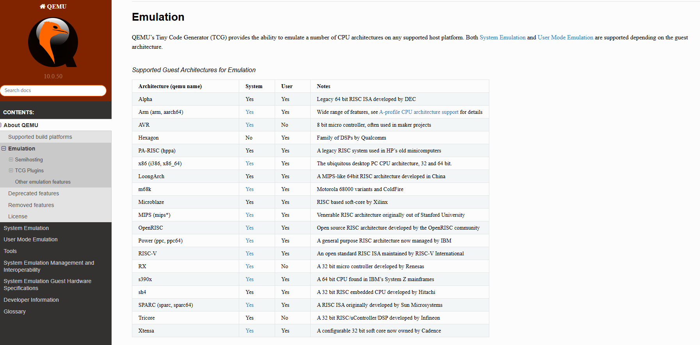
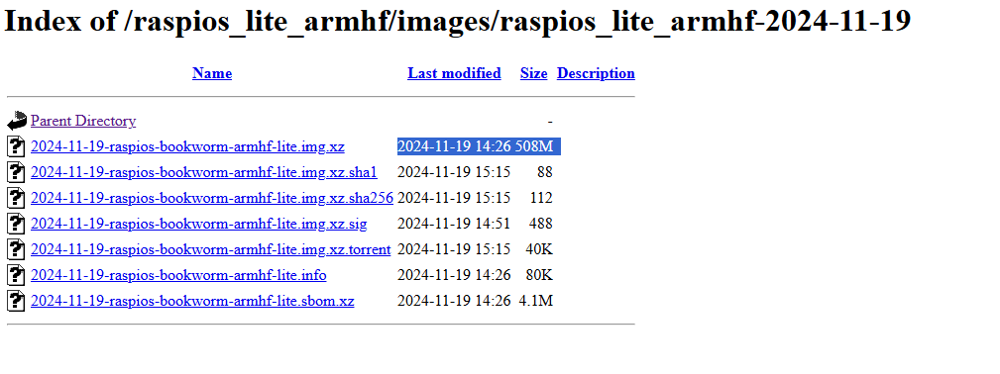
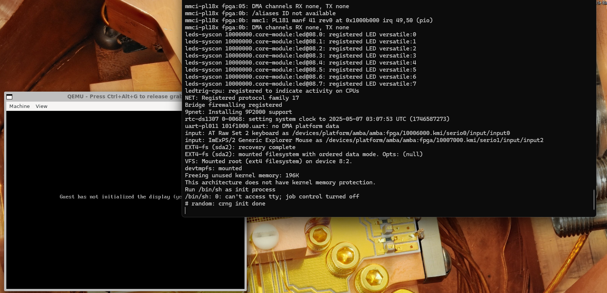
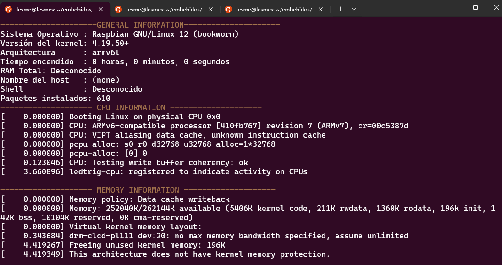
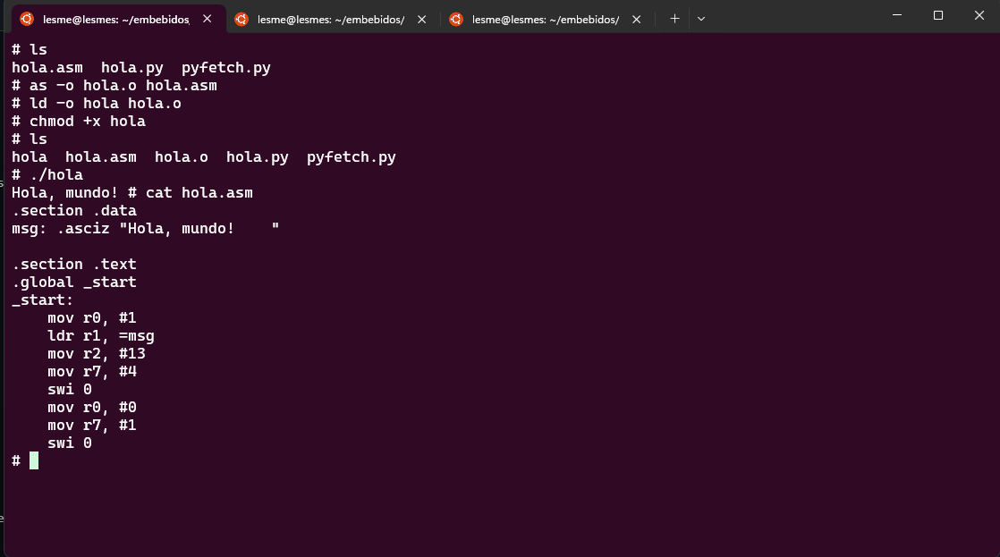
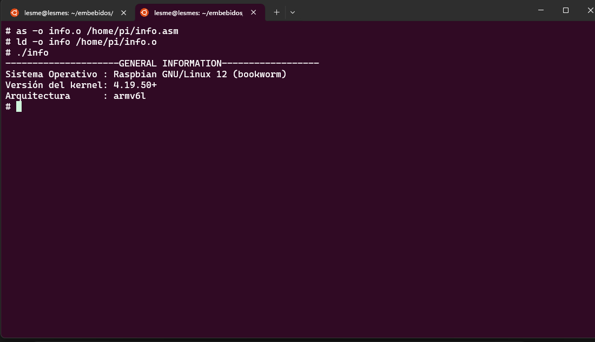

# Emuladores y Depuradores para Sistemas Embebidos

---

## 📦 Contenido

- [0. Introducción](#0-introducción)
- [1. Emuladores](#1-emuladores)
  - [1.1 QEMU](#11-qemu)
- [2. Depuradores](#2-depuradores)
  - [2.1 GDB (GNU Debugger)](#21-gdb-gnu-debugger)
  - [2.2 PDB (Python Debugger)](#22-pdb-python-debugger)
- [3. Demostración práctica](#3-demostración-práctica)
- [4. Tutorial](#4-tutorial)
- [6. Referencias](#5-referencias)

---

## 0. Introducción

Los sistemas embebidos están presentes en una gran variedad de dispositivos, desde electrodomésticos hasta automóviles y dispositivos médicos. Sin embargo, desarrollar y depurar estos sistemas puede ser complejo debido a las limitaciones de hardware, las restricciones de recursos y la falta de acceso directo a plataformas físicas en etapas tempranas de desarrollo. 

Esta guía se centra en el uso de herramientas **open source** como emuladores y depuradores, las cuales permiten simular y depurar sistemas sin la necesidad de contar con hardware físico durante el proceso de desarrollo.

## Conceptos básicos

###  Simulación, emulación y depuración

| Término     | Descripción                                                                 |
|-------------|-----------------------------------------------------------------------------|
| Simulación  | Ejecuta una representación del sistema, sin correr binarios reales.         |
| Emulación   | Ejecuta binarios como si estuvieran en el hardware objetivo (ej. QEMU).     |
| Depuración  | Permite observar, controlar y modificar la ejecución de código en tiempo real.|


### ¿Qué se espera de una Simulación y de una Emulación?

| Tipo        | ¿Qué se espera?                                                                 | Ejemplo concreto                                                |
|-------------|----------------------------------------------------------------------------------|-----------------------------------------------------------------|
| **Simulación** | Comportamiento lógico o funcional del sistema, sin ejecutar el código real.     | Simular un sensor de temperatura en MATLAB o un microcontrolador en SystemVerilog.          |
| **Emulación**  | Ejecutar el binario tal como lo haría el hardware real, con tiempos y entorno cercanos al físico. | Usar QEMU para correr una imagen de Linux ARM en tu PC o emular un microcontrolador STM32 para probar firmware.        |

### Diferencia clave:
- **Simulación**: útil para **diseño y validación temprana**.
- **Emulación**: útil para **pruebas funcionales, depuración y validación sin hardware**.


## Modelos y pruebas avanzadas

- **Hardware-in-the-Loop (HIL)**: Pruebas con hardware real o parcialmente simulado.
  > Ejemplo: Probar un firmware en una placa real conectada a un modelo simulado de sensores.
- **Gemelo Digital (Digital Twin)**: Réplica virtual del sistema físico usada para pruebas y validaciones.
  > Ejemplo: Un gemelo digital de un motor industrial permite ajustar parámetros sin detener la producción.


## Prácticas industriales 

| Tema                              | Relevancia                                                                 |
|-----------------------------------|----------------------------------------------------------------------------|
| Toolchains cruzadas               | Compilar/depurar desde PC para microcontroladores o sistemas embebidos objetivo. |
| Scripts de GDB (.gdbinit)         | Automatizar flujos repetitivos en debugging, ya sea hacerlos o usarlos.    |
| CI/CD con QEMU + GDB              | Pruebas de Integración Continua y Despliegue Continuo de firmware sin hardware real.    |
| Interfaces JTAG/SWD               | Depuración física de microcontroladores (MCUs y SoCs).                     |
| Trazas (ej. Tracealyzer, ITM)     | Análisis de eventos y tiempos en RTOS o sistemas críticos.                 |
| Breakpoints                       | Breakpoints en desarrollo, son puntos claves del codigo para analizar.     |
| Optimización vs Depuración        | Uso de flags como `-Og` para depurar código optimizado, es decur, saber cómo las optimizaciones afectan la visibilidad del código al depurar.|
| Análisis post-mortem (core dumps) | Inspección de fallos ya ocurridos.                                        |


## 1. Emuladores

### 1.1 QEMU

<p align="center">
  
</p>


QEMU (Quick Emulator) es un emulador y virtualizador de código abierto, versátil y modular, que soporta múltiples arquitecturas como ARM, x86, MIPS y RISC-V. Se utiliza principalmente de dos maneras:

- **Emulación de Sistema**: QEMU emula una máquina completa, permitiendo ejecutar un sistema operativo invitado. En este modo, la CPU puede ser completamente emulada o usar un hipervisor como KVM (Kernel-based Virtual Machine) para ejecutar directamente sobre el CPU del host. Este modo es ideal para testing  ya que permite emular sistemas completos sin necesidad de hardware real [1].

- **Emulación en Modo Usuario**: QEMU permite ejecutar programas compilados para una arquitectura de CPU diferente en otra, emulando siempre la CPU.

Además, QEMU es compatible con **gdbserver** para depuración remota, lo que facilita el desarrollo y la depuración en entornos sin acceso inmediato a hardware físico. Además herramientas como **qemu-img** para crear y modificar imágenes de disco.

<p align="center">
  
</p>


🔗 [Documentación oficial de QEMU](https://www.qemu.org/docs/master/)  
🔗 [Repositorio en GitLab](https://gitlab.com/qemu-project/qemu)

### Otros emuladores para explorar

- **Renode** – Emulador especializado en sistemas embebidos con buses y sensores. Ideal para pruebas de RTOS y simulaciones deterministas.
- **Esp32-emulator** – Para plataformas ESP32, útil en desarrollo de IoT.
- **SimAVR** – Emulador para microcontroladores AVR, popular en el desarrollo de proyectos de electrónica.
- **MSPDebug** – Emulador y depurador para microcontroladores MSP430 de Texas Instruments.
- **PicSimLab / SimulIDE** – Emuladores educativos para microcontroladores PIC y AVR, fáciles de usar para iniciarse en la programación de microcontroladores.


## 2. Depuradores

### 2.1 GDB (GNU Debugger)

<p align="center">
  
</p>


GDB es el depurador estándar para programas escritos en lenguajes como C, C++ , Assembler y otros, especialmente en entornos embebidos. Se utiliza para identificar y corregir errores en el código, permitiendo a los desarrolladores analizar el comportamiento de sus programas en tiempo real [2]. Entre sus funciones permite:

- **Depuración Remota**: GDB soporta depuración remota, lo que permite depurar aplicaciones en sistemas que no tienen acceso directo al entorno de desarrollo, como dispositivos embebidos o máquinas virtuales.

- **Breakpoints y Seguimiento**: GDB permite establecer puntos de interrupción (breakpoints) para detener la ejecución del programa en lugares específicos, inspeccionar la memoria, los registros y el estado del programa en cualquier momento durante su ejecución.

- **Conexión a Emuladores y Hardware Real**: GDB se puede conectar a emuladores como QEMU o a hardware real a través de herramientas como OpenOCD, lo que lo hace útil para trabajar en sistemas sin acceso directo al código fuente o cuando se trabaja con plataformas de hardware especializadas.

🔗 [Sitio oficial de GDB](https://www.sourceware.org/gdb/)  
🔗 [Repositorio oficial](https://sourceware.org/git/binutils-gdb.git)


### 2.2 PDB (Python Debugger)

<p align="center">
  
</p>


**PDB** es el depurador estándar incluido en Python, utilizado para diagnosticar y comprender el comportamiento de un programa durante su ejecución. Su funcionamiento se basa en una interfaz interactiva que permite examinar el estado interno del programa paso a paso [3].
PDB resulta especialmente útil para depurar scripts que interactúan con hardware, dispositivos periféricos o procesos concurrentes. Dado que muchos entornos embebidos carecen de interfaces gráficas, PDB proporciona una herramienta efectiva directamente desde la terminal [4].

Características principales:
- **Depuración interactiva**: Permite detener la ejecución en tiempo real, examinar variables, y avanzar instrucción por instrucción.
- **Puntos de interrupción (breakpoints)**: Se pueden establecer ubicaciones específicas para pausar la ejecución y observar el comportamiento del sistema.
- **Análisis post-mortem**: Posibilita revisar el estado del programa inmediatamente después de una excepción o fallo.
- **Integración directa**: Se puede activar desde el código fuente o ejecutar el script en modo depuración desde la terminal.
- **Modularidad y personalización**: Al estar implementado como una clase (Pdb), se adapta a escenarios donde se requiera extender su funcionalidad para depuración avanzada. 

🔗 [Documentación oficial](https://docs.python.org/3/library/pdb.html)  
📦 [Código fuente](https://github.com/python/cpython/blob/main/Lib/pdb.py)


### Otros depuradores para explorar

- **OpenOCD** – Conexión entre GDB y hardware físico mediante JTAG/SWD. Compatible con diversas plataformas como ARM y RISC-V.
- **pyOCD** – Depurador basado en Python para plataformas ARM Cortex-M, compatible con CMSIS-DAP.
- **SEGGER J-Link GDB Server** – Herramienta muy utilizada en entornos industriales, ideal para depuración en hardware real.
- **GDBserver** – Usado para depuración remota en sistemas Linux embebidos, trabajando junto con QEMU.
- **Tracealyzer** – Herramienta de análisis y depuración para sistemas con RTOS, ideal para estudiar la ejecución de software en plataformas embebidas.


## Casos de uso comunes de uso

| Escenario                        | Herramientas principales             |
|----------------------------------|--------------------------------------|
| MCU bare-metal                   | GDB + OpenOCD                        |
| Linux embebido                   | QEMU + GDB (gdbserver)               |
| RTOS sobre MCU                   | GDB                                  |
| CI/CD para firmware              | QEMU + GDB                           |
| Scripts Python en consola        | `pdb`                                |
| Aplicaciones Python medianas     | `pdb` + `breakpoint()`               |
| Pruebas automatizadas en Python  | `pytest` + `pdb`                     |
| Debug en notebooks interactivos  | `ipdb`, `%debug` (IPython/Jupyter)   |

---
## 3. Demostración práctica

Esta demostración busca guiar a través de un ejemplo práctico utilizando **QEMU + Python** para emular  un programa simple en un entorno embebido de Raspberry Pi OS Lite based on Debian12 (bookworm), pero en modo **shell root** directamente, sin pasar por **systemd**.
> **Nota**: `systemd` es un sistema de inicio y gestión de servicios en Linux.  
> Se encarga de arrancar todos los procesos del sistema (como redes, usuarios, etc.) después del kernel.  
> En este tutorial lo evitamos para entrar directamente a un **modo shell root minimalista**, ideal para pruebas rápidas, desarrollo embebido y debugging sin interferencias.

## Parte I: Emulación de Raspberry Pi OS Lite con QEMU en Modo Shell Root
### ✅ Prerequisitos

- Ubuntu Linux (20.04 o superior)
- Git
- QEMU instalado (Se instalan en esta guía y en el tutorial)
- Imagen `.img` de Raspberry Pi OS Lite ( `2024-11-19-raspios-bookworm-armhf-lite.img`, se instala en esta guía)
- Kernel compatible para QEMU ( `kernel-qemu-4.19.50-buster`, ya includo en el repositorio)
- Archivo `.dtb` compatible (`versatile-pb.dtb`, ya includo en el repositorio)


### 🛠️ Hardware por Emular (Target)
La siguiente tabla describe el hardware virtual que se emulará con QEMU para correr una imagen ligera de Raspberry Pi OS en un entorno completamente controlado:

| Componente          | Descripción del Componente Emulado                                                                                                    |
| ------------------- | ------------------------------------------------------------------------------------------------------------------------------------- |
| 🧠 `-cpu arm1176`   | Procesador **ARM1176JZF-S**, el mismo que utiliza la Raspberry Pi modelo 1. Soporta ARMv6 con MMU (gestión de memoria) y FPU.         |
| 💾 `-m 256`         | Memoria RAM de **256 MB**                                     |
| 📦 `-M versatilepb` | Placa base virtual **Versatile Platform Baseboard**  |
| 📀 `-hda`           | Disco duro virtual que contiene la imagen del sistema operativo: **Raspberry Pi OS Lite basado en Debian 12 (Bookworm)**.             |
| 🧬 `-dtb`           | **Device Tree Blob** que informa al sistema operativo de las características del hardware virtual (`versatile-pb.dtb`).               |
| 🐧 `-kernel`        | Kernel Linux precompilado, ajustado para funcionar sobre la arquitectura y periféricos del sistema emulado (no usa el kernel de RPi). |
| 🔡 `-serial stdio`  | Redirección del **puerto serie** a la terminal de la máquina host, permitiendo interacción por consola con el sistema emulado.        |
| 🔧 `-append`        | Parámetros de arranque: monta `/dev/sda2` como sistema raíz, usa `ext4`, y lanza directamente el **shell** (`/bin/sh`) sin `systemd`. |
| 🔁 `-no-reboot`     | Previene reinicios automáticos tras errores, ideal para tareas de depuración o análisis de bajo nivel.                                |
                                 


### Paso 1: Desde una terminal se deben instalar los siguientes paquetes:
```bash
sudo apt update
sudo apt install qemu-system-arm
sudo apt install qemu-utils
sudo apt install qemu-efi
```
### Paso 2: Clonar el Repositorio `emulators-debuggers-class`.
El repositorio completo contiene la siguiente estructura: 
```
emulators-debuggers-class/
  ├── diagnostic/
  │   ├── arbol
  │   ├── arbol.cpp
  │   └── solucion/
  ├── images/
  ├── demo/
  │   ├── pdb/
  │   │   ├── pyfetch.py
  │   │   └── pyfetch_2_0.py
  │   └── qemu/
  │       ├── run-qemu.sh
  │       └── qemu-rpi/
  │           ├── kernel-qemu-4.19.50-buster
  │           └── versatile-pb.dtb
  └── tutorial/
        ├── practica_bonus_asm
        └── qemu 
              ├── run-qemu.sh
              └── qemu-rpi/
                     ├── kernel-qemu-4.19.50-buster
                     └── versatile-pb.dtb
```

A nivel de la demostración, nos vamos a enfocar en el directorio `demo`. 

```
emulators-debuggers-class/
  ├── demo/
     ├── pdb/
     │   ├── pyfetch.py
     │   └── pyfetch_2_0.py
     └── qemu/
         ├── run-qemu.sh
         └── qemu-rpi/
             ├── kernel-qemu-4.19.50-buster
              └── versatile-pb.dtb
```

## Paso 3: Instalar la imagen de Raspberry Pi OS Lite

Para poder emular el sistema operativo de Raspberry Pi, es necesario descargar la imagen del sistema. Esta puede obtenerse desde la página oficial de Raspberry Pi. La versión más reciente al momento de esta guía es: `2024-11-19-raspios-bookworm-armhf-lite.img`.
Alternativamente, se puede descargar de manera manual en la pagina oficial de `Raspberry Pi` dentro del directorio `emulators-debuggers-class/demo/qemu` o mediante una terminal. 

🔗 [Descargar desde la página oficial](https://downloads.raspberrypi.org/raspios_lite_armhf/images/raspios_lite_armhf-2024-11-19/)

<p align="center">
  
</p>

🔗 Mediante una terminal 

Se debe ingresar dentro del directorio demo/qemu
```bash
cd ~/emulators-debuggers-class/demo/qemu
```

Luego instalar y descomprimir la imagen (puede tardar un poco, dependiendo de la conexion de internet)

Para instalar:
```bash
wget https://downloads.raspberrypi.com/raspios_lite_armhf/images/raspios_lite_armhf-2024-11-19/2024-11-19-raspios-bookworm-armhf-lite.img.xz
```
Para descomprimir: 
```bash
xz -dk 2024-11-19-raspios-bookworm-armhf-lite.img.xz
```

## Paso 4: Verificar instalaciones antes de la emulación

Para este punto dentro del directorio `emulators-debuggers-class/demo/qemu` debería contener:

```plaintext
total 2249372
1729296 -rw-r--r-- 1 laptop laptop 8589934592  2024-11-19-raspios-bookworm-armhf-lite.img
 520068 -rw-r--r-- 1 laptop laptop  532543404  2024-11-19-raspios-bookworm-armhf-lite.img.xz
      4 drwxr-xr-x 2 laptop laptop       4096  qemu-rpi
      4 -rwxr-xr-x 1 laptop laptop        309  run-qemu.sh
```

Se puede verificar mediante este comando:

```bash
ls -ls ~/emulators-debuggers-class/demo/qemu
```

Otro aspecto **importante** que se debe ver es el contenido de `run-qemu.sh`, este contiene toda la configuración necesaria para emular el sistema Raspberry OS Lite con Qemu.

Al hacer `cat` a `run-qemu.sh` dentro del directorio `~/emulators-debuggers-class/demo/qemu`

```bash
cat run-qemu.sh
```
se despliega su contenido por respuesta:

```plaintext
qemu-system-arm \
  -kernel qemu-rpi/kernel-qemu-4.19.50-buster \
  -cpu arm1176 \
  -m 256 \
  -M versatilepb \
  -dtb qemu-rpi/versatile-pb.dtb \
  -no-reboot \
  -serial stdio \
  -append "root=/dev/sda2 rootfstype=ext4 rw console=ttyAMA0 init=/bin/sh"  \
  -hda 2024-11-19-raspios-bookworm-armhf-lite.img
```
Estos parámetros tienen un significado que configuran al dispositivo a emular.

| Parámetro        | Descripción                                                                                                                                            |
| ---------------- | ------------------------------------------------------------------------------------------------------------------------------------------------------ |
| `-kernel`        | Kernel Linux compilado para QEMU y compatible con Raspberry Pi.                                                                                        |
| `-cpu arm1176`   | Emula la CPU ARMv6 usada en las primeras Raspberry Pi.                                                                                                 |
| `-m 256`         | Asigna 256 MB de memoria RAM al sistema emulado.                                                                                                       |
| `-M versatilepb` | Emula la placa base VersatilePB, compatible con el kernel proporcionado.                                                                               |
| `-dtb`           | Archivo Device Tree (`.dtb`) necesario para describir el hardware virtualizado.                                                                        |
| `-no-reboot`     | Impide que QEMU reinicie automáticamente tras un apagado.                                                                                              |
| `-serial stdio`  | Redirige la consola serial al terminal para poder interactuar con el sistema.                                                                          |
| `-append`        | Parámetros pasados al kernel: define la raíz del sistema, el tipo de sistema de archivos, la consola, y arranca directamente en una shell (`/bin/sh`). |
| `-hda`           | Imagen del sistema Raspberry Pi OS Lite que se monta como disco principal.                                                                             |


>**Nota**: La imagen utilizada (2024-11-19-raspios-bookworm-armhf-lite.img) en este entorno inicia en modo shell (init=/bin/sh), útil para debugging o configuraciones avanzadas. Para arrancar el sistema completo, puedes cambiar esa línea por:
>
>```plaintext
>append "root=/dev/sda2 rootfstype=ext4 rw console=ttyAMA0"
>```


## Paso 5: A emular

Primero se le deben dar permisos al ejecutable `run-qemu.sh`.

```bash
chmod +x run-qemu.sh
```
A emular:

```bash
./run-qemu.sh
```
Se debería desplegar una ventana como esta,


<p align="center">
  
</p>

Pero lo importante está en la terminal, esta versión de Raspberry OS no cuenta con interfaz gráfica, pero si con Python, G++ y GDB integrados.

### ✅ Paso 5.1: Interactuar con el sistema
En este momento, al estar dentro del sistema `Raspberry` OS Lite se puede interactuar de manera básica con el sistema de la siguiente manera: 

- Ver directorios de root.

```bash
ls /
```
- Ver información sobre la distribución de Linux utilizada:
  
```bash
cat /etc/os-release
```
- Ver toda la información disponible del kernel del sistema.
```bash
uname -a
```
- Ver la versión de Python, as (GNU Binutils for Raspbian) y GDB.

```bash
python3 --version; as --version; gdb --version
```
---

# 🔧 Parte II: Programar y Depurar dentro de la Emulación con Python y PDB

### Paso 6: Familiarizarse con las herramientas de depuración
Para esta sección, requerimos de 4 herramientas:
- Un editor de texto, en este caso se utilizará `vi` (Ya incluído en la imagen).
- El código a depurar. (Se incluye más adelante)
- El intérprete de Python (Ya incluído en la imagen)
- El depurador PDB (Ya incluído en la imagen).


### 🧭 Paso 6.1: Uso de `vi` como editor de texto

Al no tener interfaz gráfica, se trabaja con editores en terminal. Uno de los más comunes es `vi`, un editor poderoso y presente por defecto en la mayoría de sistemas UNIX/Linux.

#### Modo de uso

`vi` trabaja con **dos modos** principales:
- **Normal**: para comandos (volver con `ESC`)
- **Inserción**: para escribir texto (`i`, `a`, `o`, etc.)

###  Comandos esenciales de `vi`

| Categoría | Comando | Descripción |
|----------|---------|-------------|
| **Insertar** | `i` / `I` | Insertar antes / al inicio de línea |
|              | `a` / `A` | Insertar después / al final de línea |
|              | `o` / `O` | Nueva línea debajo / encima |
|              | `ESC`     | Volver al modo normal |
| **Guardar / Salir** | `:w` / `:q` | Guardar / salir |
|                    | `:wq`       | Guardar y salir |
|                    | `:q!`       | Salir sin guardar |
|                    | `ZZ`        | Guardar y salir (modo normal) |
| **Movimiento** | `h` `j` `k` `l` | Izquierda / abajo / arriba / derecha |
|                | `0` / `^` / `$` | Inicio / 1er carácter / final de línea |
|                | `gg` / `G` / `:n` | Inicio / fin / ir a línea `n` |
| **Edición** | `x` / `dd` / `yy` | Borrar carácter / borrar línea / copiar línea |
|             | `p` / `P`         | Pegar debajo / encima |
|             | `u` / `Ctrl+r`    | Deshacer / rehacer |
| **Buscar** | `/texto` / `?texto` | Buscar hacia abajo / arriba |
|            | `n` / `N`         | Siguiente / anterior coincidencia |
| **Otros** | `:set number` / `:set nonumber` | Mostrar / ocultar números de línea |
|           | `:syntax on` / `:syntax off`   | Activar / desactivar resaltado |

Para empezar a editar un archivo desde la terminal:
```bash
vi archivo.py
```
Despliega en esta caso, el programa (En este caso se creo un "Hola mundo") :

<p align="center">
  
</p>


### 📀 Paso 6.2: Código a Depurar 

El siguiente script es una utilidad ligera escrita en Python que muestra información básica del sistema al estilo de Neofetch, una herramienta popular en Linux para mostrar datos del sistema de forma visual y estética en la terminal.
 
> **Nota:** **Neofetch** es una herramienta de línea de comandos escrita en **Bash** que muestra información del sistema de forma visual y personalizable.  
>
> Se puede instalar con:
>
> ```bash
> sudo apt install neofetch
> ```
> 
> Se puede ejecutar:
>
> ```bash
> neofetch
> ```


**El codigo por depurar es el siguente**:

En la terminal de  Qemu, se debe acceder al directorio `home/pi` de esta manera `cd home/pi`. Luego se debe ejecutar, lo siguiente (Este es el código a depurar).  
```bash
echo "!/usr/bin/env python3\nimport platform\nimport os\nimport time\n\n# Obtener información del sistema\n\ndef system_info():\n    # Intentar obtener el tiempo de actividad\n    try:\n        with open('/proc/uptime', 'r') as f:\n            uptime_seconds = float(f.readline().split()[0])\n    except FileNotFoundError:\n        uptime_seconds = 0\n    uptime_hours = int(uptime_seconds / 3600)\n    uptime_minutes = int((uptime_seconds % 3600) / 60)\n    uptime_seconds_final = int(uptime_seconds % 60)\n\n    # Intentar obtener la memoria total\n    try:\n        with open('/proc/meminfo', 'r') as f:\n            lines = f.readlines()\n        mem_total = int(lines[0].split()[1]) // 1024  # Convertir de KB a MB\n        mem_total_gb = round(mem_total / 1024, 2)  # Convertir de MB a GB\n    except FileNotFoundError:\n        mem_total = 'Desconocido'\n        mem_total_gb = 'Desconocido'\n    except Exception as e:\n        mem_total = 'Error: ' + str(e)\n        mem_total_gb = 'Error'\n\n    # Intentar obtener el nombre del host\n    host_name = platform.node() or 'Desconocido'\n\n    # Intentar obtener el sistema operativo y su versión\n    try:\n        with open('/etc/os-release', 'r') as f:\n            os_info = f.read().splitlines()\n        os_name = [line for line in os_info if 'PRETTY_NAME' in line][0].split('=')[1].strip('\"')\n    except FileNotFoundError:\n        os_name = 'Desconocido'\n\n    # Intentar obtener la shell usada\n    try:\n        shell = os.environ.get('SHELL', 'Desconocido')\n    except Exception:\n        shell = 'Desconocido'\n\n    # Intentar obtener paquetes instalados\n    try:\n        with open('/var/lib/dpkg/status', 'r') as f:\n            package_count = sum(1 for line in f if line.startswith('Package:'))\n    except FileNotFoundError:\n        package_count = 'Desconocido'\n\n    # Obtener la versión del kernel\n    kernel_version = os.popen('uname -r').read().strip()\n\n    # Obtener información de la CPU\n    try:\n        cpu_info = os.popen('dmesg | grep -i \"cpu\"').read\n    except Exception:\n        cpu_info = 'Error al obtener información de la CPU'\n\n    # Obtener detalles de RAM desde dmesg\n    try:\n        ram_info = os.popen('dmesg | grep -i \"memory\"').read\n    except Exception:\n        ram_info = 'Error al obtener información de RAM'\n\n    # Imprimir la información del sistema\n    print('\\033[93m---------------------GENERAL INFORMATION---------------------\\033[0m')\n    print(f'Sistema Operativo : {os_name}')\n    print(f'Versión del kernel: {kernel_version}')\n    print(f'Arquitectura      : {platform.machine()}')\n    print(f'Tiempo encendido  : {uptime_hours} horas, {uptime_minutes} minutos, {uptime_seconds_final} segundos')\n    print(f'RAM Total         : {mem_total_gb} GB' if mem_total != 'Desconocido' else 'RAM Total: Desconocido')\n    print(f'Nombre del host   : {host_name}')\n    print(f'Shell             : {shell}')\n    print(f'Paquetes instalados: {package_count}')\n\n    # Imprimir información separada sobre la CPU\n    print('\\033[93m' + '-' * 20 + ' CPU INFORMATION ' + '-' * 20 + '\\033[0m')\n    print(cpu_info)\n\n    # Imprimir información separada sobre la RAM\n    print('\\033[93m' + '-' * 20 + ' MEMORY INFORMATION ' + '-' * 20 + '\\033[0m')\n    print(ram_info)\n\nif __name__ == '__main__':\n    oos.system('clear')  # En Windows sería 'cls'\n    system_info()" > /home/pi/pyfetch.py
```
> A este punto se debe haber creado el script llamado `pyfetch.py`, se puede verificar haciendo un  `ls` en la terminal.

### Paso 6.3: Depuración
El script llamado `pyfetch.py`, presenta una serie de errores, que deben ser corregidos para desplegar la información del sistema de manera correcta, esto se realizará mediante el uso del depurador PDB integra de manera nativa en Python. El objetivo del script es desplegar lo siguiente: 

<p align="center">
  
</p>

### 🛠 Comandos útiles dentro de pdb

| Comando           | Significado                                                            |
| ----------------- | ---------------------------------------------------------------------- |
| `n`               | Ejecuta la siguiente línea (sin entrar a funciones)                    |
| `s`               | Entra a la función en la línea actual (*step into*)                    |
| `c`               | Continua la ejecución hasta el siguiente *breakpoint*                  |
| `q`               | Sale del depurador (*quit*)                                            |
| `p var`           | Imprime el valor de una variable (`p x`)                               |
| `l`               | Lista el código fuente alrededor de la línea actual                    |
| `b línea`         | Establece un *breakpoint* en la línea indicada (`b 42`)                |
| `b archivo:línea` | Establece un *breakpoint* en un archivo específico (`b pyfetch.py:30`) |
| `cl número`       | Elimina un *breakpoint* (`cl 1`)                                       |
| `disable número`  | Desactiva temporalmente un *breakpoint* (`disable 1`)                  |
| `enable número`   | Reactiva un *breakpoint* desactivado (`enable 1`)                      |
| `where` / `w`     | Muestra el *call stack* (rastro de llamadas)                           |
| `args`            | Muestra los argumentos de la función actual                            |
| `retval`          | Muestra el valor devuelto por la última función al salir de ella       |
| `! expr`          | Ejecuta una expresión Python arbitraria (por ejemplo, `!x.append(1)`)  |
| `help`            | Muestra ayuda general o de un comando específico (`help p`)            |

---
Para depurar se deben aplicar las siguientes banderas:
```bash
python3 -m pdb pyfetch.py
```

- Reto a: ERROR 1 (¿SE COMENTA O NO?)
 
- Reto b: ERROR 2 (¿La biblioteca está correctamente usada?)

- Reto c: ERROR 3 (¿Y mis datos de CPU?)

- Reto d: ERROR 4 (¿Y mis datos de RAM?))


---
## 4. Tutorial

Este tutorial proporciona una guía paso a paso para emular un programa simple en un entorno embebido utilizando **QEMU + AS + GDB**, ejecutando directamente en **modo shell root** sobre una imagen de **Raspberry Pi OS Lite basada en Debian 12 (Bookworm)**, sin pasar por `systemd`.

> 🎯 **Objetivo final**: Ejecutar un entorno shell funcional en QEMU y poder compilar/programar con herramientas embebidas.

---

### ✅ Prerrequisitos

Asegúrate de contar con lo siguiente:

- Ubuntu Linux 20.04 o superior
- Herramientas necesarias instaladas (se detallan a continuación)
- Imagen `.img` de Raspberry Pi OS Lite  
  `2024-11-19-raspios-bookworm-armhf-lite.img`
- Kernel compatible para QEMU `kernel-qemu-4.19.50-buster` (ya incluido)
- Árbol de dispositivos `.dtb` compatible `versatile-pb.dtb` (ya incluido)

> 📝 **Nota importante**: Para el documento a entregar, **toma una captura de pantalla** al finalizar cada paso y colócala en el documento de plantilla adjunto.
> Recomendación: Revisar la plantilla para conocer que pasos requieren de captura de pantalla.

---

### 🛠️ Hardware por Emular (Target)
La siguiente tabla describe el hardware virtual que se emulará con QEMU para correr una imagen ligera de Raspberry Pi OS en un entorno completamente controlado:

| Componente          | Descripción del Componente Emulado                                                                                                    |
| ------------------- | ------------------------------------------------------------------------------------------------------------------------------------- |
| 🧠 `-cpu arm1176`   | Procesador **ARM1176JZF-S**, el mismo que utiliza la Raspberry Pi modelo 1. Soporta ARMv6 con MMU (gestión de memoria) y FPU.         |
| 💾 `-m 256`         | Memoria RAM de **256 MB**, suficiente para sistemas embebidos ligeros como Raspberry Pi OS Lite.                                      |
| 📦 `-M versatilepb` | Placa base virtual **Versatile Platform Baseboard**, una plataforma de referencia ampliamente soportada por QEMU para entornos ARM.   |
| 📀 `-hda`           | Disco duro virtual que contiene la imagen del sistema operativo: **Raspberry Pi OS Lite basado en Debian 12 (Bookworm)**.             |
| 🧬 `-dtb`           | **Device Tree Blob** que informa al sistema operativo de las características del hardware virtual (`versatile-pb.dtb`).               |
| 🐧 `-kernel`        | Kernel Linux precompilado, ajustado para funcionar sobre la arquitectura y periféricos del sistema emulado (no usa el kernel de RPi). |
| 🔡 `-serial stdio`  | Redirección del **puerto serie** a la terminal de la máquina host, permitiendo interacción por consola con el sistema emulado.        |
| 🔧 `-append`        | Parámetros de arranque: monta `/dev/sda2` como sistema raíz, usa `ext4`, y lanza directamente el **shell** (`/bin/sh`) sin `systemd`. |
| 🔁 `-no-reboot`     | Previene reinicios automáticos tras errores, ideal para tareas de depuración o análisis de bajo nivel.                                |
                                 


### 🔧 Paso 1: Instalar herramientas necesarias

Desde una terminal, ejecuta los siguientes comandos:

```bash
sudo apt update
sudo apt install qemu-system-arm qemu-efi
```

### Paso 2: Clonar el Repositorio `emulators-debuggers-class`.
El repositorio completo contiene la siguiente estructura: 
```
emulators-debuggers-class/
  ├── diagnostic/
  │   ├── arbol
  │   ├── arbol.cpp
  │   └── solucion/
  ├── images/
  ├── demo/
  │   ├── pdb/
  │   │   ├── pyfetch.py
  │   │   └── pyfetch_2_0.py
  │   └── qemu/
  │       ├── run-qemu.sh
  │       └── qemu-rpi/
  │           ├── kernel-qemu-4.19.50-buster
  │           └── versatile-pb.dtb
  └── tutorial/
        ├── practica_c_gdb
        ├── practica_bonus_asm
        ├── plantilla_tutorial
        └── practica_qemu 
              ├── run-qemu.sh
              └── qemu-rpi/
                     ├── kernel-qemu-4.19.50-buster
                     └── versatile-pb.dtb
```

A nivel de este tutorial guía, nos vamos a enfocar en el directorio `tutorial`. 

```
emulators-debuggers-class/
  ├── tutorial/
        ├── practica_c_gdb
        ├── plantilla_tutorial
        ├── practica_bonus_asm
        └── practica_qemu 
              ├── run-qemu.sh
              └── qemu-rpi/
                     ├── kernel-qemu-4.19.50-buster
                     └── versatile-pb.dtb
```

## Paso 3: Instalar la imagen de Raspberry Pi OS Lite

Para poder emular el sistema operativo de Raspberry Pi, es necesario descargar la imagen del sistema. Esta puede obtenerse desde la página oficial de Raspberry Pi. La versión más reciente al momento de esta guía es: `2024-11-19-raspios-bookworm-armhf-lite.img`.
Alternativamente, se puede descargar de manera manual en la pagina oficial de `Raspberry Pi` dentro del directorio `emulators-debuggers-class/tutorial/qemu` o mediante una terminal. 

🔗 [Descargar desde la página oficial](https://www.raspberrypi.com/software/operating-systems/)

<p align="center">
  
</p>

🔗 Mediante una terminal 

Se debe ingresar dentro del directorio `tutorial/qemu`
```bash
cd ~/emulators-debuggers-class/tutorial/qemu
```

Luego instalar y descomprimir la imagen (puede tardar un poco, dependiendo de la conexion de internet)
```bash
wget https://downloads.raspberrypi.com/raspios_lite_arm64/images/raspios_lite_arm64-2024-11-19/2024-11-19-raspios-bookworm-arm64-lite.img.xz
xz -dk 2024-11-19-raspios-bookworm-arm64-lite.img.xz
```

## Paso 4: Verificar instalaciones antes de la emulación

Para este punto dentro del directorio `emulators-debuggers-class/tutorial/qemu` debería contener:

```plaintext
total 2249372
1729296 -rw-r--r-- 1 laptop laptop 8589934592  2024-11-19-raspios-bookworm-armhf-lite.img
 520068 -rw-r--r-- 1 laptop laptop  532543404  2024-11-19-raspios-bookworm-armhf-lite.img.xz
      4 drwxr-xr-x 2 laptop laptop       4096  qemu-rpi
      4 -rwxr-xr-x 1 laptop laptop        309  run-qemu.sh
```

Se puede verificar mediante este comando:

```bash
ls -ls ~/emulators-debuggers-class/tutorial/qemu
```

Otro aspecto **importante** que se debe ver es el contenido de `run-qemu.sh`, este contiene toda la configuración necesaria para emular el sistema Raspberry OS Lite con Qemu.

Al hacer `cat` a `run-qemu.sh` dentro del directorio `~/emulators-debuggers-class/tutorial/qemu`

```bash
cat run-qemu.sh
```
se despliega su contenido por respuesta:

```plaintext
qemu-system-arm \
  -kernel qemu-rpi/kernel-qemu-4.19.50-buster \
  -cpu arm1176 \
  -m 256 \
  -M versatilepb \
  -dtb qemu-rpi/versatile-pb.dtb \
  -no-reboot \
  -serial stdio \
  -append "root=/dev/sda2 rootfstype=ext4 rw console=ttyAMA0 init=/bin/sh"  \
  -hda 2024-11-19-raspios-bookworm-armhf-lite.img
```
Estos parámetros tienen un significado que configuran al dispositivo a emular.

| Parámetro        | Descripción                                                                                                                                            |
| ---------------- | ------------------------------------------------------------------------------------------------------------------------------------------------------ |
| `-kernel`        | Kernel Linux compilado para QEMU y compatible con Raspberry Pi.                                                                                        |
| `-cpu arm1176`   | Emula la CPU ARMv6 usada en las primeras Raspberry Pi.                                                                                                 |
| `-m 256`         | Asigna 256 MB de memoria RAM al sistema emulado.                                                                                                       |
| `-M versatilepb` | Emula la placa base VersatilePB, compatible con el kernel proporcionado.                                                                               |
| `-dtb`           | Archivo Device Tree (`.dtb`) necesario para describir el hardware virtualizado.                                                                        |
| `-no-reboot`     | Impide que QEMU reinicie automáticamente tras un apagado.                                                                                              |
| `-serial stdio`  | Redirige la consola serial al terminal para poder interactuar con el sistema.                                                                          |
| `-append`        | Parámetros pasados al kernel: define la raíz del sistema, el tipo de sistema de archivos, la consola, y arranca directamente en una shell (`/bin/sh`). |
| `-hda`           | Imagen del sistema Raspberry Pi OS Lite que se monta como disco principal.                                                                             |

## Paso 5: A emular

Primero se le deben dar permisos al ejecutable `run-qemu.sh`.

```bash
chmod +x run-qemu.sh
```
A emular:

```bash
./run-qemu.sh
```
Se debería desplegar una ventana como esta,

<p align="center">
  
</p>

Pero lo importante está en la terminal, esta versión de Raspberry OS no cuenta con interfaz gráfica, pero si con Python, G++ y GDB integrados. 

### ✅ Paso 5.1: Interactuar con el sistema
En este momento, al estar dentro del sistema `Raspberry OS Lite` se puede interactuar de manera básica con el sistema de la siguiente manera: 

- Ver directorios de root.

```bash
ls /
```
- Ver información sobre la distribución de Linux utilizada:
  
```bash
cat /etc/os-release
```
- Ver toda la información disponible del kernel del sistema.
```bash
uname -a
```

- Ver la versión de Python, as y GDB.
```bash
python3 --version; as --version; gdb --version
```

- **NUEVO:** Ver el registro de arranque del sistema.
```bash
dmesg
```


# 🔧 Parte II: Programar y Depurar en Ensamblador con `as` y GDB

### Paso 6: Familiarizarse con las herramientas de depuración
Para esta sección, requerimos de 4 herramientas:
- Un editor de texto, en este caso se utilizará `vi` (Ya incluido en la imagen).
- El código a depurar (se incluye más adelante).
- El ensamblador `as` (Ya incluido en la imagen).
- El depurador GDB (Ya incluido en la imagen).


### 🧭 Paso 6.1: Uso de `vi` como editor de texto

Al no tener interfaz gráfica, se trabaja con editores en terminal. Uno de los más comunes es `vi`, un editor poderoso y presente por defecto en la mayoría de sistemas UNIX/Linux.

#### Modo de uso

`vi` trabaja con **dos modos** principales:
- **Normal**: para comandos (volver con `ESC`)
- **Inserción**: para escribir texto (`i`, `a`, `o`, etc.)

###  Comandos esenciales de `vi`

| Categoría | Comando | Descripción |
|----------|---------|-------------|
| **Insertar** | `i` / `I` | Insertar antes / al inicio de línea |
|              | `a` / `A` | Insertar después / al final de línea |
|              | `o` / `O` | Nueva línea debajo / encima |
|              | `ESC`     | Volver al modo normal |
| **Guardar / Salir** | `:w` / `:q` | Guardar / salir |
|                    | `:wq`       | Guardar y salir |
|                    | `:q!`       | Salir sin guardar |
|                    | `ZZ`        | Guardar y salir (modo normal) |
| **Movimiento** | `h` `j` `k` `l` | Izquierda / abajo / arriba / derecha |
|                | `0` / `^` / `$` | Inicio / 1er carácter / final de línea |
|                | `gg` / `G` / `:n` | Inicio / fin / ir a línea `n` |
| **Edición** | `x` / `dd` / `yy` | Borrar carácter / borrar línea / copiar línea |
|             | `p` / `P`         | Pegar debajo / encima |
|             | `u` / `Ctrl+r`    | Deshacer / rehacer |
| **Buscar** | `/texto` / `?texto` | Buscar hacia abajo / arriba |
|            | `n` / `N`         | Siguiente / anterior coincidencia |
| **Otros** | `:set number` / `:set nonumber` | Mostrar / ocultar números de línea |
|           | `:syntax on` / `:syntax off`   | Activar / desactivar resaltado |


### Flujo de Trabajo para Crear un Programa en Ensamblador ARM

Es importante recordar el flujo del ensamblador

```bash
hola.asm 
   ↓ (Ensamblador: as)
hola.o
   ↓ (Linker: ld)
hola  →  Ejecutable
```

#### 🧾 Paso 1: Crear o Editar el archivo fuente (Ensamblador)

Para empezar a escribir o editar tu archivo fuente en ensamblador, puedes hacerlo con un editor de texto como `vi` o cualquier otro editor disponible:

```bash
echo '.section .data\nmsg: .asciz "Hola, mundo!    "\n\n.section .text\n.global _start\n_start:\n    mov r0, #1\n    ldr r1, =msg\n    mov r2, #13\n    mov r7, #4\n    swi 0\n    mov r0, #0\n    mov r7, #1\n    swi 0' > /home/pi/hola.asm
```
Para abrirlo con un editor como vi:

```bash
vi hola.asm
```

Debe desplegar esto:

```paintext
.section .data
    msg: .asciz "Hola, mundo!  " // Mensaje 

.section .text
    .global _start

_start:
    mov r0, #1            // Establece el descriptor de archivo para stdout
    ldr r1, =msg          // Carga la dirección del mensaje en r1
    mov r2, #13           // Longitud del mensaje
    mov r7, #4            // Número de llamada al sistema para escribir
    swi 0                 // Llamada al sistema para escribir el mensaje

    mov r0, #0            // Código de salida
    mov r7, #1            // Número de llamada al sistema para salir
    swi 0                 // Llamada al sistema para salir del programa
```

#### Tabla de registros registros utilizados en **ARM32**

| Registro   | Nombre (32 bits) | Descripción                                                                                                                           |
| ---------- | ---------------- | ------------------------------------------------------------------------------------------------------------------------------------- |
| **R0-R3**  | **r0 - r3**      | Registros de propósito general, usados para pasar parámetros y devolver valores en las funciones.                                     |
| **R4-R7**  | **r4 - r7**      | Registros de propósito general. Usados como registros temporales en la mayoría de las instrucciones.                                  |
| **R8-R12** | **r8 - r12**     | Registros de propósito general. Pueden ser utilizados por el compilador para almacenar valores temporales.                            |
| **R13**    | **SP**           | **Stack Pointer**. Apunta al tope de la pila en el sistema.                                                                           |
| **R14**    | **LR**           | **Link Register**. Guarda la dirección de retorno cuando se hace una llamada a función (return address).                              |
| **R15**    | **PC**           | **Program Counter**. Contiene la dirección de la siguiente instrucción a ejecutar.                                                    |
| **CPSR**   | **CPSR**         | **Current Program Status Register**. Contiene el estado actual de los flags de la CPU (estado de las interrupciones, el modo, etc.).  |
| **SPSR**   | **SPSR**         | **Saved Program Status Register**. Almacena el estado del CPSR cuando se cambia de modo (por ejemplo, al entrar en una interrupción). |


#### 🏗 Paso 2: Ensamblado (Traducción a Código Máquina)
El paso de ensamblado convierte el código fuente en ensamblador a código máquina. Usamos el ensamblador as para generar el archivo objeto:

```bash
as -o hola.o hola.asm
```

#### 🔍 Paso 3: Inspeccionar el Ensamblador desde el Objeto
Una vez generado el archivo objeto, se puedes inspeccionar con objdump para ver cómo el código ensamblador de manera comparativa con el códidp realizado:

```bash
objdump -d /home/pi/hola.o
```

#### 🔗 Paso 4: Enlace (Linking)
El enlazado (linking) es el proceso donde el archivo objeto se convierte en un ejecutable final. Usamos el enlazador ld para combinar el archivo objeto con las bibliotecas y generar el ejecutable:

```bash
ld -o hola hola.o
```

#### 🔒 Paso 5: Otorgar permisos de ejecución
Una vez que tienes el ejecutable, asegúrate de otorgar permisos de ejecución al archivo:

```bash
chmod +x hola
```

#### 🚀 Paso 6: Ejecución
Finalmente, ejecuta el programa desde la termina.

```bash
./hola
```

<p align="center">
  
</p>


### 📀 Paso 6.2: Código a Depurar 

El siguiente script es una utilidad ligera escrita en Assembler que muestra información básica del sistema al estilo de Neofetch pero de manera textual, sin acceder dinamicamente a las fuentes.
 
> **Nota:** **Neofetch** es una herramienta de línea de comandos escrita en **Bash** que muestra información del sistema de forma visual y personalizable.  
>
> Se puede instalar con:
>
> ```bash
> sudo apt install neofetch
> ```
> 
> Se puede ejecutar:
>
> ```bash
> neofetch
> ```


**El codigo por depurar es el siguente**:

En la terminal de  Qemu, se debe acceder al directorio `home/pi` de esta manera `cd home/pi`. Luego se debe ejecutar, lo siguiente (Este es el código a depurar).  
```bash
echo '.section .data\ntitulo: .asciz "---------------------GENERAL INFORMATION------------------\n"\nso_info: .asciz "Sistema Operativo : Raspbian GNU/Linux 12 (bookworm)\n"\nkernel_info: .asciz "Versión del kernel: 4.19.50+\n"\narch_info: .asciz "Arquitectura      : armv6l\n"\n\n.section .text\n.global _start\n\n_start:\n\nprint_titulo:\n    mov r0, #1              // stdout\n    ldr r1, =titulo         // puntero al mensaje\n    mov r2, #60             // longitud\n    mov r7, #4              // syscall write\n    swi 0\n\nprint_so:\n    mov r0, #1\n    ldr r1, =so_info\n    mov r2, #54\n    mov r7, #4\n    swi 0\n\nprint_kernel:\n    mov r0, #1\n    ldr r1, =kernel_info\n    mov r2, #31\n    mov r7, #4\n    swi 0\n\nprint_arch:\n    mov r0, #1\n    ldr r1, =arch_info\n    mov r2, #28\n    mov r7, #4\n    swi 0\n\nexit_program:\n    mov r0, #0\n    mov r7, #1\n    swi 0' > /home/pi/info.asm

```
> A este punto se debe haber creado el script llamado `info.asm`, se puede verificar haciendo un  `ls` en la terminal.


### Paso 6.3: Depuración
El script llamado `info.asm`, presenta una serie de errores, que deben ser corregidos para desplegar la información del sistema de manera correcta, esto se realizará mediante el uso del depurador GDB integra de manera nativa en Python. El objetivo del script es desplegar lo siguiente: 

<p align="center">
  
</p>

### 🛠 Comandos útiles dentro de gdb

| Comando                           | Descripción                                                                                        |
| --------------------------------- | -------------------------------------------------------------------------------------------------- |
| `gdb ./programa`                  | Inicia GDB con el programa especificado.                                                           |
| `run` (o `r`)                     | Inicia la ejecución del programa.                                                                  |
| `break <línea>` (o `b <línea>`)   | Coloca un punto de interrupción en una línea específica del código. Ejemplo: `b 10` para línea 10. |
| `break <función>`                 | Coloca un punto de interrupción en una función específica.                                         |
| `continue` (o `c`)                | Continúa la ejecución hasta el siguiente punto de interrupción.                                    |
| `next` (o `n`)                    | Avanza al siguiente paso de código, pero sin entrar en las funciones.                              |
| `step` (o `s`)                    | Avanza al siguiente paso de código, entrando en las funciones si las hay.                          |
| `finish`                          | Completa la ejecución de la función actual y regresa al lugar donde fue llamada.                   |
| `print <variable>`                | Muestra el valor de una variable. Ejemplo: `print x`.                                              |
| `info locals`                     | Muestra las variables locales de la función actual.                                                |
| `info args`                       | Muestra los argumentos de la función actual.                                                       |
| `info break`                      | Muestra información sobre los puntos de interrupción actuales.                                     |
| `delete <número>`                 | Elimina el punto de interrupción con el número especificado.                                       |
| `list`                            | Muestra las líneas de código fuente cercanas al punto donde está el programa.                      |
| `backtrace` (o `bt`)              | Muestra la pila de llamadas (stack trace).                                                         |
| `quit` (o `q`)                    | Sale de GDB.                                                                                       |
| `watch <variable>`                | Coloca un "watchpoint" para que GDB detenga la ejecución cuando el valor de una variable cambie.   |
| `info registers`                  | Muestra el contenido de todos los registros del procesador.                                        |
| `disassemble`                     | Muestra el código ensamblador de la función actual o de la región de memoria especificada.         |
| `set variable <variable>=<valor>` | Cambia el valor de una variable en tiempo de ejecución.                                            |
| `list <función>`                  | Muestra el código fuente de una función específica.                                                |
| `x/<n> <dirección>`               | Muestra el contenido de memoria en formato hexadecimal o ASCII. Ejemplo: `x/10x $esp`.             |
| `start`                           | Inicia la ejecución del programa y se detiene en la primera línea de la función `main`.            |


---
Para ensamblar el codigo con las bandera de depuración, se deben aplicar las siguientes banderas:

```bash
as -g -o info.o /home/pi/info.asm
```

```bash
ld -g -o info info.o
```

```bash
gdb ./info
```

Una vez dentro de GDB, lo primero siempre es definir los breakpoints dados por las etiquetas de la siguiente manera:

```bash
(gdb) break _start
```
```bash
(gdb) break print_titulo
```
```bash
(gdb) break print_os
```
```bash
(gdb) break print_kernel
```
```bash
(gdb) break print_arch
```

5. Depuración interactiva
Puedes ir revisando los registros y la memoria, o incluso ir paso por paso, con comandos como:

- info registers: Ver los valores actuales de los registros.
```bash
 info registers
```

- x/10xw $sp: Ver el contenido de un registro en hexadecimal.
```bash
x/c 0x<reg>
```
- step o next para avanzar entre las instrucciones.
```bash
step
```
---
- Reto a: ERROR 1 (¿El salto de linea es así?)
 
- Reto b: ERROR 2 (¿El salto de linea es así?)

- Reto c: ERROR 3 (¿El salto de linea es así?)

- Reto d: ERROR 4 (¿El salto de linea es así?)


---

## 5. Referencias

[1] QEMU Project. “QEMU: A generic and open source machine emulator and virtualizer,” *GitLab repository*. [Online]. Available: [https://gitlab.com/qemu-project/qemu](https://gitlab.com/qemu-project/qemu)

[2] GNU Project. “GDB: The GNU Debugger,” *Sourceware repository*. [Online]. Available: [https://sourceware.org/git/binutils-gdb.git](https://sourceware.org/git/binutils-gdb.git)

[3] Python Software Foundation. “pdb — The Python Debugger,” *Python 3 Documentation*. [Online]. Available: [https://docs.python.org/3/library/pdb.html](https://docs.python.org/3/library/pdb.html)

[4] Python Software Foundation. “pdb.py — Source code,” *CPython GitHub Repository*. [Online]. Available: [https://github.com/python/cpython/blob/main/Lib/pdb.py](https://github.com/python/cpython/blob/main/Lib/pdb.py)
